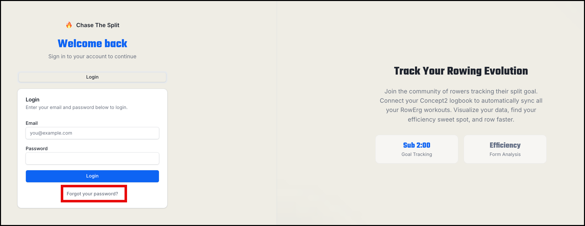

---

title: How to Reset Your Password

---

Locked out? Chase The Split gives you two ways back in: an email reset code, or your security question. Both start from the Forgot password? link on the login page.

#### Option 1: Email reset code

1. On the login page, click the "Forgot password ?" link. 

2. Choose the email reset option.

3. Enter the email address on your account and submit. If an account with that email exists, we'll send a 6-character reset code.
4. Check your inbox (and spam folder) for the code.
5. Enter the code along with your new password.

A few things to know about reset codes:

* Codes expire after 15 minutes. If yours has expired, just request a new one.
* Each code works once. After a successful reset, the code can't be reused.
* If you request multiple codes, use the most recent one.

#### Option 2: Security question

If you set a security question when you created your account, you can use it instead:

1. On the login page, click the "Forgot password ?" link. 

2. Choose the security question option.

3. Enter your username (not email) — we'll show you your security question.
4. Enter your answer and your new password. Answers aren't case-sensitive.

Note: newer accounts don't have security questions (we no longer ask for one at signup), so if you see a message saying no security question is set, use the email reset instead.

#### Tips if you're stuck

* Too many attempts in a short window will be rate-limited — wait a few minutes and try again.
* If you never receive the email, double-check you're entering the exact email address on your account.
* Still locked out? Contact support and we'll help you recover access.
